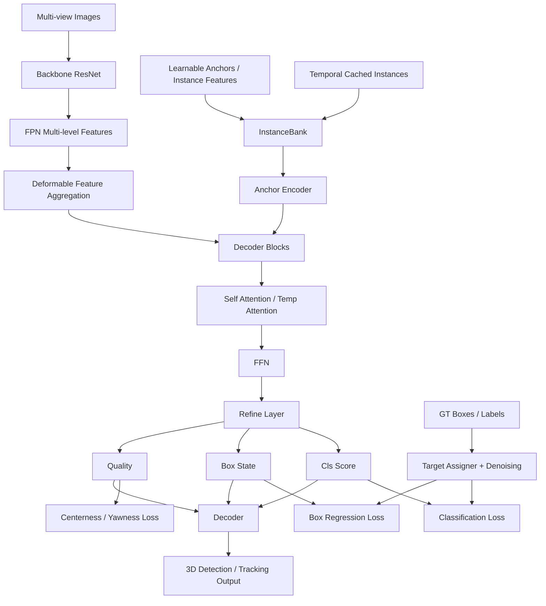

# Sparse4D 学习版 README

这份文档面向第一次读 `Sparse4D` 系列代码的新手，目标不是覆盖所有细节，而是帮你把：

1. 论文在讲什么
2. 代码从哪里进
3. 每个模块在做什么
4. `config`、模型结构、`loss` 分别该怎么看

串成一条清晰的学习路线。

论文：

- Sparse4D v3: https://arxiv.org/abs/2311.11722

从论文摘要看，v3 的核心增量有三件事：

- `Temporal Instance Denoising`
- `Quality Estimation`
- `Decoupled Attention`

这三件事在当前仓库里都能找到比较明确的代码落点。

## 1. 先建立整体图景

### 1.1 从论文看整体任务

Sparse4D 是一个基于稀疏实例表示的多目时序 3D 感知框架。它不先显式构建 BEV 大网格，而是维护一组稀疏的 3D instance / anchor，再不断用：

- 当前帧多视角图像特征
- 上一时刻传播过来的实例
- 解码器中的多轮 refine

去更新这些实例，最后输出检测框，并在推理时为实例分配 `instance id`，从而扩展到 tracking。

### 1.2 从代码看整体入口

模型入口非常清楚：

- 检测器入口：`projects/mmdet3d_plugin/models/sparse4d.py`
- 头部主逻辑：`projects/mmdet3d_plugin/models/sparse4d_head.py`
- 3D 检测相关模块：`projects/mmdet3d_plugin/models/detection3d/`
- 实例缓存与时序传播：`projects/mmdet3d_plugin/models/instance_bank.py`
- 实验入口 config：`projects/configs/sparse4dv3_temporal_r50_1x8_bs6_256x704.py`

### 1.3 项目框架图

下面这个图建议你边看边对照 `Sparse4D.forward_train -> head.forward -> head.loss` 这条主链。

同时仓库里也有原作者提供的结构图，可以一起看：

## 2. 建议你怎么结合 paper 学代码

### 2.1 不要一上来就扎进所有模块

对新手来说，最容易迷路的原因是“代码比论文具体很多”。建议你按下面顺序读：

1. 先看论文摘要、方法总览图，记住输入、输出、三项核心改进。
2. 再看 config，弄清楚这个实验到底实例化了哪些模块。
3. 再沿着一次前向传播读模型主路径。
4. 最后再看 `target / loss / decoder / tracking id` 这些训练与后处理细节。

### 2.2 推荐阅读顺序

第一轮，只追主流程：

1. `projects/configs/sparse4dv3_temporal_r50_1x8_bs6_256x704.py`
2. `projects/mmdet3d_plugin/models/sparse4d.py`
3. `projects/mmdet3d_plugin/models/sparse4d_head.py`
4. `projects/mmdet3d_plugin/models/blocks.py`
5. `projects/mmdet3d_plugin/models/detection3d/detection3d_blocks.py`

第二轮，再补训练细节：

1. `projects/mmdet3d_plugin/models/detection3d/target.py`
2. `projects/mmdet3d_plugin/models/detection3d/losses.py`
3. `projects/mmdet3d_plugin/models/detection3d/decoder.py`
4. `projects/mmdet3d_plugin/models/instance_bank.py`

第三轮，再补数据与时序：

1. `projects/mmdet3d_plugin/datasets/pipelines/transform.py`
2. `projects/mmdet3d_plugin/datasets/nuscenes_3d_det_track_dataset.py`

## 3. 从 config 角度读代码

如果你只能选一个文件开始，建议先读：

- `projects/configs/sparse4dv3_temporal_r50_1x8_bs6_256x704.py`

因为 config 基本就是“论文方法在工程里的实例化”。

### 3.1 先看几个最关键的开关

这几个变量几乎直接对应论文的设计选择：

- `temporal = True`
- `decouple_attn = True`
- `with_quality_estimation = True`
- `num_decoder = 6`
- `num_single_frame_decoder = 1`

含义可以先粗记成：

- `temporal=True`：启用时序实例传播和 temporal attention。
- `decouple_attn=True`：启用论文中的 decoupled attention。
- `with_quality_estimation=True`：启用质量预测分支。
- `num_single_frame_decoder=1`：第一个 decoder block 只看当前帧，后面的 block 再做时序交互。

### 3.2 config 里最值得对照论文的几块

#### 1) Backbone + Neck

- `img_backbone`: ResNet
- `img_neck`: FPN

这部分负责把 6 个相机图像编码成多尺度特征。

#### 2) Instance Bank

- `instance_bank.num_anchor=900`
- `num_temp_instances=600`

可以把它理解成模型维护的一组“稀疏 3D 查询 / 实例槽位”。其中一部分来自当前的 learnable anchor，另一部分来自上一帧缓存的高置信实例。

#### 3) Anchor Encoder

- `SparseBox3DEncoder`
- `mode="cat"`
- `embed_dims=[128, 32, 32, 64]`

这里正对应论文里的 decoupled attention 思想：位置、尺寸、朝向、速度分开编码，再拼起来。

#### 4) Decoder 的操作顺序

`operation_order` 很关键，它告诉你每个 decoder block 实际执行什么：

- `temp_gnn`
- `gnn`
- `norm`
- `deformable`
- `ffn`
- `norm`
- `refine`

可以把它当成论文方法在代码中的“执行脚本”。

#### 5) Sampler / Loss / Decoder

- `sampler=SparseBox3DTarget`
- `loss_cls=FocalLoss`
- `loss_reg=SparseBox3DLoss`
- `decoder=SparseBox3DDecoder`

这部分决定：

- GT 怎么匹配到预测
- dn 训练怎么做
- box loss 怎么算
- quality 怎么参与训练和排序

## 4. 从模型结构角度读代码

### 4.1 顶层模型 `Sparse4D`

顶层模型在 `projects/mmdet3d_plugin/models/sparse4d.py`，职责很简单：

- 提特征：`extract_feat`
- 调 head 前向：`self.head(feature_maps, data)`
- 调 head loss：`self.head.loss(model_outs, data)`

所以可以把它看成一个“总控器”，真正的算法主体在 `head` 里。

### 4.2 图像特征提取

`extract_feat` 的流程是：

1. 把多相机输入 reshape 成 `(bs * num_cams, C, H, W)`
2. 经过 backbone
3. 经过 FPN
4. 再 reshape 回 `(bs, num_cams, C, H, W)`
5. 可选走 `depth_branch` 做辅助深度监督

它只负责给后面的 sparse decoder 提供多尺度图像特征。

### 4.3 真正的核心：`Sparse4DHead`

`Sparse4DHead` 可以理解成整个 Sparse4D 的“大脑”。

它在做五件事：

1. 从 `InstanceBank` 取当前实例和历史实例
2. 生成 denoising anchors
3. 按照 `operation_order` 跑一串 decoder blocks
4. 输出多层 decoder 的分类、回归、质量预测
5. 缓存高质量实例，供下一帧使用

### 4.4 InstanceBank 在干什么

`InstanceBank` 是理解时序的关键。

它不是普通的 memory bank，而是维护：

- 一组可学习初始 anchors
- 一组可学习 instance feature
- 上一帧缓存下来的高置信实例
- 这些实例对应的 instance id

它的核心逻辑可以记成三步：

1. `get()`：取出当前 learnable anchors，并把历史实例投影到当前帧坐标系。
2. `update()`：在 decoder 中间把历史实例和当前高置信实例拼起来。
3. `cache()`：当前帧结束后缓存 top-k 高置信实例，留给下一帧。

这就是论文里“temporal sparse instances”在代码中的落点。

### 4.5 Anchor Encoder 为什么重要

`SparseBox3DEncoder` 负责把 3D 框状态编码成 attention 用的 embedding。

它把框分成几个部分分别编码：

- 中心点 `(x, y, z)`
- 尺寸 `(w, l, h)`
- 朝向 `(sin(yaw), cos(yaw))`
- 速度 `(vx, vy, vz)`

这就是为什么它特别适合和论文里的 decoupled attention 对应起来看。

### 4.6 Decoder block 到底在干什么

每一轮 decoder 的典型过程可以理解为：

1. `temp_gnn`：和历史实例交互
2. `gnn`：当前实例之间自注意力交互
3. `deformable`：从多视角多尺度图像特征中取证据
4. `ffn`：进一步变换特征
5. `refine`：更新 box，预测分类和质量

其中最值得单独看的是 `deformable` 和 `refine`。

### 4.7 `DeformableFeatureAggregation`

这个模块是 Sparse4D 的视觉证据抽取核心。

它做的事情可以概括成：

1. 在每个 3D anchor 内生成多个 key points
2. 用投影矩阵把 3D 点投到各个相机图像上
3. 在多尺度 feature map 上采样
4. 用 learned weights 融合不同 view / level / point 的特征

这就是论文里的 Efficient Deformable Aggregation。

### 4.8 `RefinementModule`

`SparseBox3DRefinementModule` 负责：

- 回归新的 box 状态
- 预测分类分数
- 预测质量分数 `quality`

注意这里 box 不是一次性直接预测的，而是在前一轮 anchor 的基础上迭代 refine，这一点和很多 query-based detector 的“逐层 refinement”一致。

## 5. 从 loss 角度读代码

新手最容易觉得 loss 很碎，所以这里建议只抓三层结构：

1. GT 如何编码和匹配
2. 分类 / 回归 loss 如何算
3. 额外辅助项如何加入

### 5.1 GT 是如何表示的

`SparseBox3DTarget.encode_reg_target` 会把 GT box 编码成：

- 中心 `(x, y, z)`
- 对数尺度 `log(w), log(l), log(h)`
- 朝向 `sin(yaw), cos(yaw)`
- 后续速度等状态

这一步非常重要，因为后面的预测和 loss 都是在这个编码空间中进行的，而不是直接在原始 `(w, l, h, yaw)` 空间里。

### 5.2 GT 和预测如何匹配

`SparseBox3DTarget.sample` 用的是 Hungarian matching。

匹配 cost 由两部分组成：

- 分类 cost
- 框回归 cost

所以可以把它理解成 DETR 风格的一对一分配，只不过这里预测对象是 sparse 3D instances。

### 5.3 分类 loss

分类 loss 是 `FocalLoss`，用于解决正负样本不平衡。

由于 anchor 数量很多，而真正匹配上的 GT 很少，这种稀疏检测场景里用 focal loss 很自然。

### 5.4 回归 loss

`SparseBox3DLoss` 的主体是 box L1 loss，但这里还有两个很有论文味道的附加项：

- `centerness loss`
- `yawness loss`

它们都来自 `quality estimation`。

### 5.5 Quality Estimation 是怎么闭环的

这是 v3 最值得你单独追的一条线。

它分三步：

1. `refine` 分支额外预测两个 quality 值。
2. `losses.py` 里对 quality 做监督。
3. `decoder.py` 推理时用 centerness 重新调整分类排序。

也就是说，quality 不是只“训练不用”，而是训练和推理都参与了。

其中：

- `centerness` 约束预测框中心和 GT 中心是否接近
- `yawness` 约束预测朝向是否正确

这样做的动机和论文是一致的：分类分数不一定能真实反映 3D box 质量，所以要额外预测质量。

### 5.6 Temporal Instance Denoising 是怎么做的

这也是 v3 的核心改进之一。

可以把它理解成：

- 用 GT 生成带噪声的 dn anchors
- 这些 noisy queries 也进入 decoder
- 它们有自己的分类和回归监督
- 时序版本还会利用 instance id，把历史 dn 信息和当前帧对应起来

这件事的作用是让 decoder 更稳定，也增加正样本监督信号。

### 5.7 辅助深度监督

config 里还有一个 `depth_branch`：

- 它只用于辅助监督
- 不属于最终核心输出

作用是让图像特征带有更强的几何感知能力。

## 6. 论文三项核心改进，对应到哪些代码

### 6.1 Temporal Instance Denoising

重点看：

- `projects/mmdet3d_plugin/models/detection3d/target.py`
- `projects/mmdet3d_plugin/models/sparse4d_head.py`

你可以重点追这几个函数：

- `get_dn_anchors`
- `update_dn`
- `prepare_for_dn_loss`

理解重点：

- dn anchor 是怎么从 GT 加噪生成的
- 正负 dn 样本怎么构造
- temporal dn 怎么借助 `instance_id` 对齐

### 6.2 Quality Estimation

重点看：

- `SparseBox3DRefinementModule`
- `SparseBox3DLoss`
- `SparseBox3DDecoder`

理解重点：

- quality 的输出维度是什么
- centerness / yawness 的监督目标怎么构造
- 推理时为什么要用 quality 调整排序

### 6.3 Decoupled Attention

重点看：

- `SparseBox3DEncoder`
- `Sparse4DHead.graph_model`

理解重点：

- anchor 的不同属性为何分开编码
- 为什么 `query` / `key` 里要拼接 `query_pos`
- 为什么 `fc_before` / `fc_after` 会把维度扩到 `2 * embed_dims`

## 7. 模块功能总表

| 模块 | 文件 | 功能 |
| --- | --- | --- |
| 顶层检测器 | `models/sparse4d.py` | 组织 backbone、neck、head、train/test 流程 |
| 主头部 | `models/sparse4d_head.py` | 实例获取、decoder 执行、loss/postprocess 接口 |
| 时序实例缓存 | `models/instance_bank.py` | 缓存历史实例、做时序传播、分配 tracking id |
| 图像特征聚合 | `models/blocks.py` | deformable feature aggregation、辅助深度分支、FFN |
| Anchor 编码/Refine | `models/detection3d/detection3d_blocks.py` | box 编码、关键点生成、逐层 refine、quality 预测 |
| Target 分配 | `models/detection3d/target.py` | Hungarian matching、box 编码、dn anchor 构造 |
| Loss | `models/detection3d/losses.py` | box L1、centerness、yawness |
| 后处理 | `models/detection3d/decoder.py` | box 解码、top-k 排序、quality 重排、tracking 输出 |
| 数据适配 | `datasets/pipelines/transform.py` | 组织投影矩阵、图像尺寸、深度监督、GT 张量化 |
| 数据集 | `datasets/nuscenes_3d_det_track_dataset.py` | 读取 nuScenes、多相机参数、时序序列组织 |

## 8. 读代码时你可以带着哪些问题

每读一个模块，建议只问自己 1 到 2 个问题。

### 8.1 读 config 时

- 这个模块是不是论文提出的核心模块？
- 它在整个前向传播里大概处于哪一步？

### 8.2 读 head 时

- 当前这一层是在“实例之间交互”，还是在“从图像中取证据”？
- 这一层输出的是 feature，还是 box / cls / quality？

### 8.3 读 loss 时

- 这个 loss 对应的是“分数正确”还是“几何正确”？
- 它作用在 learnable queries，还是 dn queries，还是两者都有？

## 9. 给新手的最小闭环学习法

如果你时间有限，我建议按下面方式做一个最小闭环：

1. 先读论文摘要和方法图，只记住三项改进。
2. 再读 config，把 `model=dict(...)` 里面的模块都认出来。
3. 然后只追一次 `forward_train`：
   `extract_feat -> head.forward -> head.loss`
4. 最后单独追一条“quality estimation”线：
   `refine -> loss -> decoder`

因为这条线最完整，也最能帮你建立“论文设计是如何落实到训练和推理”的感觉。

## 10. 我建议你接下来真的去看的代码位置

如果你准备开始逐文件阅读，我建议优先看下面这些函数：

- `Sparse4D.extract_feat`
- `Sparse4DHead.forward`
- `InstanceBank.get / update / cache`
- `DeformableFeatureAggregation.forward`
- `SparseBox3DRefinementModule.forward`
- `SparseBox3DTarget.sample`
- `SparseBox3DTarget.get_dn_anchors`
- `SparseBox3DLoss.forward`
- `SparseBox3DDecoder.decode`

## 11. 一句话总结

你可以把 Sparse4D v3 暂时理解成：

“维护一组稀疏 3D 实例，让它们在多帧之间传递记忆，在每一层 decoder 中一边彼此交互、一边去图像里取证据，再通过 box refine、quality estimation 和 denoising 训练，最终得到更稳定的 3D detection / tracking 结果。”
